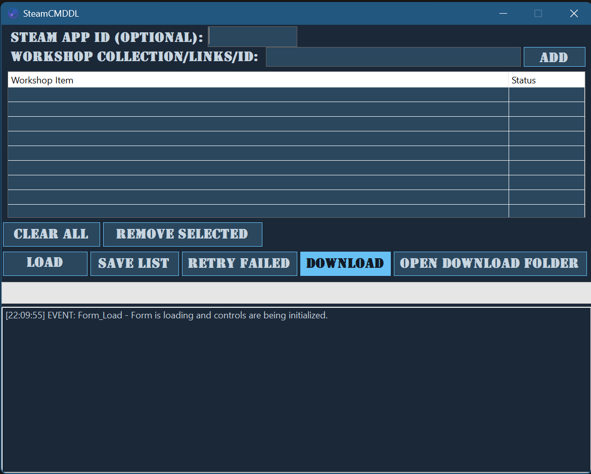

# Steam Workshop Downloader

A simple and easy-to-use C# Windows Forms application for downloading Steam Workshop items for any game. This tool automates the use of SteamCMD, allowing users to download multiple items, including entire collections, with a convenient graphical interface.

*^ You should take a screenshot of your finished app and replace the link above!*

---

## ✨ Features

This tool was built to be powerful yet simple. Here's what it can do:

* **Bulk Downloads:** Download multiple workshop items at once.
* **Collection Support:** Just paste a link to a Steam Workshop collection to add all its items to the download queue.
* **Automatic App ID Detection:** If you leave the App ID field blank, the application will automatically find it from the first workshop link in your list.
* **Self-Contained:** Automatically downloads and manages its own instance of SteamCMD. No manual setup is required.
* **Detailed Status:** A real-time list view shows the status of each item ("Pending", "Downloading...", "Success", "Failed").
* **Intelligent Error Handling:** The app reads the output from SteamCMD to provide more accurate success/failure statuses.
* **Retry Failed:** A convenient button to automatically retry any downloads that failed.
* **Save & Load Lists:** Save your favorite mod lists (including the App ID) to a text file and load them back any time.

---

## 🚀 Getting Started

### Prerequisites

You only need the **.NET Desktop Runtime** installed on your computer. If you have Visual Studio for C# development, you already have this.
* [.NET 8 Desktop Runtime (x64)](https://dotnet.microsoft.com/en-us/download/dotnet/8.0)

### How to Use

1.  Download the latest `.exe` from the [Releases](https://github.com/SINABSH/SteamCMDDL/releases/tag/v1.0.0) page.
2.  Place the `.exe` file in its own folder (e.g., on your Desktop).
3.  Run the application. It will automatically download and set up SteamCMD on the first run.
4.  Enter the **Steam App ID** for your game, or leave it blank to let the app auto-detect it.
5.  Add workshop items by:
    * Pasting an ID or link into the "Add New Item" box and clicking "Add".
    * Pasting a link to a Steam Collection and clicking "Add".
    * Loading a previously saved list using the "Load List..." button.
6.  Click the **Download** button to begin.

The downloaded files will appear in a sub-folder: `\steamcmd\steamapps\workshop\content\[App ID]\`. You can open this folder directly using the "Open Download Folder" button.

---

## 📜 License

This project is licensed under the **MIT License** - see the [LICENSE](LICENSE) file for details.
